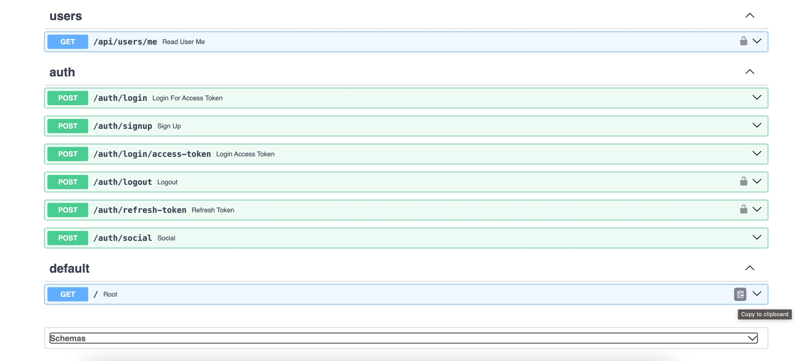
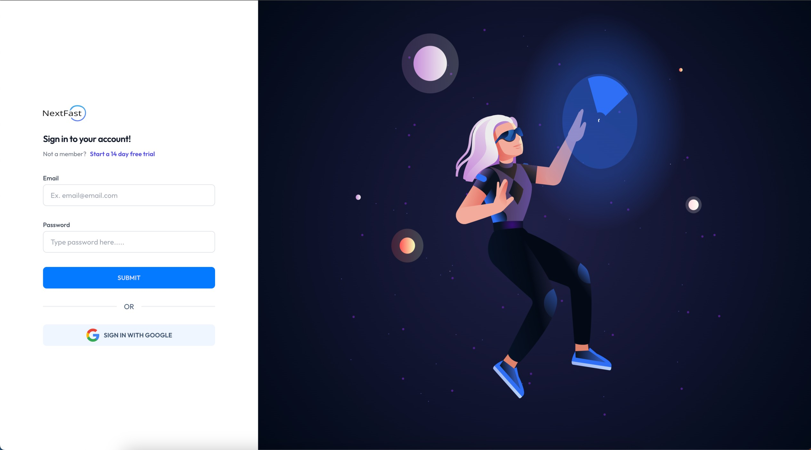

# {{cookiecutter.project_name}} - Project Generator

Author: {{cookiecutter.author_name}}
Email: {{cookiecutter.email}}

{{cookiecutter.description}}

## 🚨 Warning: still in construction 😎 🏗️

Generate a backend and frontend stack using Python, including interactive API documentation.

### Interactive API documentation

[](https://github.com/teebarg/next-fast-template)

### Dashboard Login

[](https://github.com/teebarg/next-fast-template)

## Features

* Full **Docker** integration (Docker based).
* **Docker Compose** integration and optimization for local development.
* Python **FastAPI** backend:
    * **Fast**: Very high performance, on par with **NodeJS** and **Go** (thanks to Starlette and Pydantic).
    * **Intuitive**: Great editor support. <abbr title="also known as auto-complete, autocompletion, IntelliSense">Completion</abbr> everywhere. Less time debugging.
    * **Easy**: Designed to be easy to use and learn. Less time reading docs.
    * **Short**: Minimize code duplication. Multiple features from each parameter declaration.
    * **Robust**: Get production-ready code. With automatic interactive documentation.
    * **Standards-based**: Based on (and fully compatible with) the open standards for APIs: <a href="https://github.com/OAI/OpenAPI-Specification" class="external-link" target="_blank">OpenAPI</a> and <a href="http://json-schema.org/" class="external-link" target="_blank">JSON Schema</a>.
* **JWT token** authentication.
* **SQLModel** models (independent of Flask extensions, so they can be used with Celery workers directly).
* Basic starting models for users (modify and remove as you need).
* **Alembic** migrations.
* **CORS** (Cross Origin Resource Sharing).

* **Nextjs** frontend:
    * **JWT Authentication** handling.
    * Uses **NextAuth** for authentication.
    * Login view.
    * After login, main dashboard view.
    * Main dashboard with user creation and edition.
    * Self user edition.
    * **TypeScript**.
    * It's also easy to remove it if you have an API-only app, check the instructions in the generated `README.md`.
* **PGAdmin** for PostgreSQL database, you can modify it to use PHPMyAdmin and MySQL easily.
* Load balancing between frontend and backend with **Traefik**, so you can have both under the same domain, separated by path, but served by different containers.
* Traefik integration, including Let's Encrypt **HTTPS** certificates automatic generation.

## How to use it

Go to the directory where you want to create your project and run:

```bash
pip install cookiecutter
cookiecutter https://github.com/teebarg/next-fast-template
```

### Generate passwords

You will be asked to provide passwords and secret keys for several components. Open another terminal and run:

```bash
openssl rand -hex 32
# Outputs something like: 99d3b1f01aa639e4a76f4fc281fc834747a543720ba4c8a8648ba755aef9be7f
```

Copy the contents and use that as password / secret key. And run that again to generate another secure key.

### Input variables

The generator (cookiecutter) will ask you for some data, you might want to have at hand before generating the project.

The input variables, with their default values (some auto generated) are:

* `project_name`: The name of the project
* `project_slug`: The development friendly name of the project. By default, based on the project name
* `domain_main`: The domain in where to deploy the project for production (from the branch `production`), used by the load balancer, backend, etc. By default, based on the project slug.
* `domain_staging`: The domain in where to deploy while staging (before production) (from the branch `master`). By default, based on the main domain.

* `secret_key`: Backend server secret key. Use the method above to generate it.
* `first_superuser`: The first superuser generated, with it you will be able to create more users, etc. By default, based on the domain.
* `first_superuser_password`: First superuser password. Use the method above to generate it.
* `backend_cors_origins`: Origins (domains, more or less) that are enabled for CORS (Cross Origin Resource Sharing). This allows a frontend in one domain (e.g. `https://dashboard.example.com`) to communicate with this backend, that could be living in another domain (e.g. `https://api.example.com`). It can also be used to allow your local frontend (with a custom `hosts` domain mapping, as described in the project's `README.md`) that could be living in `http://dev.example.com:8080` to communicate with the backend at `https://stag.example.com`. Notice the `http` vs `https` and the `dev.` prefix for local development vs the "staging" `stag.` prefix. By default, it includes origins for production, staging and development, with ports commonly used during local development by several popular frontend frameworks (Vue with `:8080`, React, Angular).

* `postgres_password`: Postgres database password. Use the method above to generate it. (You could easily modify it to use MySQL, MariaDB, etc).
* `pgadmin_default_user`: PGAdmin default user, to log-in to the PGAdmin interface.
* `pgadmin_default_user_password`: PGAdmin default user password. Generate it with the method above.

* `nextauth_secret`: Secret for Next Auth package.
* `nextauth_url`: Next Auth Url. Ex http://localhost:4000.
* `next_public_domain`: Nextjs Domain. Ex <http://localhost:4000>.
* `image_url`: Your image storage url.
* `google_client_id`: Google client id for auth, storage.
* `google_client_secret`: Google client secret.

## More details

After using this generator, your new project (the directory created) will contain an extensive `README.md` with instructions for development, deployment, etc. You can pre-read [the project `README.md` template here too](./{{cookiecutter.project_slug}}/README.md).

## License

This project is licensed under the terms of the MIT license.
